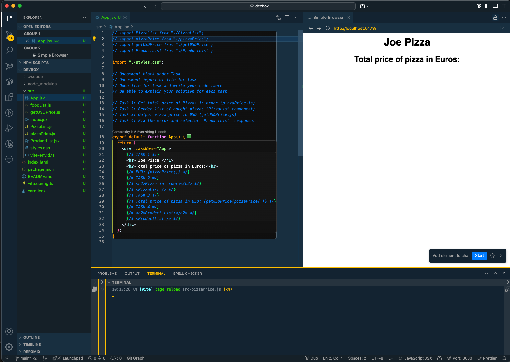

 # Devbox Code Challenge

This project is designed for use in an interview setting. You will be working with a simple React application and completing a series of tasks in `src/App.jsx` and related files.

## Prerequisites

Before you begin, ensure you have the following installed:

- **Node.js** (https://nodejs.org/)
- **Yarn** (https://classic.yarnpkg.com/en/docs/install/)
- **Visual Studio Code** (https://code.visualstudio.com/)
- **Live Preview Extension**  
   Install from: [Live Preview - Visual Studio Marketplace](https://marketplace.visualstudio.com/items?itemName=ms-vscode.live-server)

  ### Important: If you have GitHub Copilot or any other AI coding assistant enabled, please disable them for the duration of this challenge.

## Getting Started

1. **Open the Project in VS Code**
    - Launch Visual Studio Code.
    - Open the project folder (`devbox`).

2. **Install Dependencies**
    - Open a terminal in VS Code.
    - Run:
       ```
       yarn
       ```

3. **Start the Development Server**
    - In the terminal, run:
       ```
       yarn dev
       ```
    - The terminal will display a local URL, typically `http://localhost:5173/`.

4. **Open the Main App File**
    - Open `src/App.jsx` in the editor.

5. **Open Live Preview**
    - Install Microsoft's extension 'Live Preview' if you haven't already.
    - Open the Command Palette (`CTRL+SHIFT+P` or `CMD+SHIFT+P` on Mac).
    - Search for `Simple Browser: Show` and select it.
    - In the Simple Browser, navigate to the URL shown in your terminal (e.g., `http://localhost:5173/`).

## Your Setup Should Look Like

- **VS Code** with the project open.
- **Terminal** running `yarn dev`.
- **src/App.jsx** open in the editor.
- **Live Preview** (Simple Browser) open and displaying your app at `http://localhost:5173/`.



---

You are now ready to begin the coding tasks as described in the comments within `src/App.jsx`. Good luck!